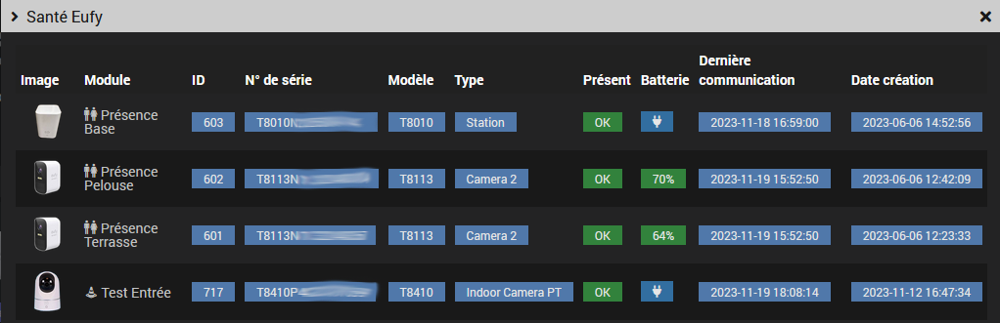

# Jeedom Plugin for Eufy Devices/Stations


## Documentation
- [Configuration](#configuration)
- [Auto-Discovery](#auto-discovery)
- [Synchronization](#synchronization)
- [Health](#health)
- [Equipments](#equipments)
- [Bugs and Troubleshooting](#bugs-and-troubleshooting)

### Configuration

Install the plugin and its dependencies.
You have a choice between local and remote modes for docker or lxc.

Note: 
* Installing dependencies does NOT install the `eufy-security-ws` image.

#### 1. Common Parameters
- Docker Container: `eufy-security-ws` container IP address and port, `localhost:3000` by default
- Daemon socket port: eufyd daemon port, `60600` by default. Do not change this value unless you have a conflict with another plugin
- Test: Check the `eufy-security-ws` container presence and its connection to the Eufy Cloud service

Notes:
- The Eufy daemon will not start if the `eufy-security-ws` container cannot connect to the Eufy Cloud service.
- The installed image version (if it exists) is shown in the `Installed version` field

#### 2. Local Mode


The local mode installation requires `docker` modules. They are now installed and configured automatically.

The plugin does not require the use of `#plugin-docker2` but it is possible to import the generated `data/docker-compose.yml` file if you prefer to manage the image yourself with this plugin.

Additional parameters:
- Device: name of your phone in the Eufy app, used to connect to the Eufy Cloud server
- Username and password: it is recommended to create a dedicated user
- Target version: `latest` by default or the version you want

Docker image configuration post-installation:

- Install: installs and starts the `eufy-security-ws` image
- Restart: restarts the `eufy-security-ws` service (relaunch if you change container parameters)
- Uninstall: stops and uninstalls the `eufy-security-ws` image
- Upgrade: updates the `eufy-security-ws` image with the requested version

#### 3. Local Mode via Command Line (Expert)

Once the dependencies are installed, you can also use the `eufy` script available in `resources`
to install, verify and manage the `eufy-security-ws` image and test your cameras via command line:

```
$ ./eufy
usage: eufy [-h] [-d device] [-u url] action
-h show this help message and exit
action: { install|uninstall|upgrade|start|stop|restart|status|info|logs|test }
test optional arguments:
      -d DEVICE device serial number
      -u URL eufy service URL, default 127.0.0.1:3000
```

```
eufy status # check the image and container status
eufy info # check the image and container status (extended info)
eufy test # check if the container is connected to the eufy cloud
eufy logs # get the container logs
```
#### 4. Remote Mode (Expert)


Use this if you have deployed the `eufy-security-ws` image on a remote docker or lxc.
Here are the files to adapt and copy to the remote server:
```
resources/docker-compose.yml
resources/eufy
```

### Auto-Discovery


Automatic detection and creation of devices.
Note:<br> Only certain models have been tested. The complete list of models that may work is available [here](https://bropat.github.io/eufy-security-client/#/supported_devices).
If your model is on this list and does not work as expected, you can send me the result of the `eufy test` command. See [Unsupported Devices or Commands](#unsupported-devices-or-commands) for more info.

### Synchronization

Updates values for all active devices. You can also update each device with the `Refresh` command

### Health


List and status of active devices. 

### Equipments


Commands are divided between Station and Camera categories. 
<br>The device image can be modified if necessary.
<br>The Other Commands tab groups presence, the `Refresh` command and additional commands. 
The following additional commands can be created:

#### Station Commands
- Chime
- Trigger alarm
- Stop alarm
- Reboot

#### Pan & Tilt Commands (motorized cameras)
- Up, down, left, right
- Calibration


Warning! These commands may or may not work depending on the model.

#### Renaming Labels (Dropdown Menus)


It is possible to rename dropdown menu labels. For example, Custom1 to Alarm for the `guardMode` command. The format is as follows:

`0|Away;1|Home;2|Schedule;3|Alarm;4|Custom 2;5|Custom 3;47|Geofencing;63|Disarmed`

Warning! Do not modify the values.

#### Widgets

If my custom widgets are installed, they will be automatically applied: snapshot, dropdown list, alarm mode, switch. For more information see [here](https://github.com/lxrootard/widgets_v4).


#### Snapshots

The `Last Camera Picture` command contains the URL of the image on the server
<br> You can use my [ImageViewer](https://github.com/lxrootard/widgets_v4) widget.
<br> Remember to enable image notifications in your device settings from the Eufy app otherwise snapshots will not be updated

#### RTSP Video Stream
The RTSP stream works in the [Camera](https://doc.jeedom.com/en_US/plugins/security/camera) plugin or an application like VLC.
<br>It must be enabled/disabled via the equipment commands `RTSP Stream On` and `RTSP Stream Off`.
<br>Depending on the devices, the login/password is either your Eufy account or one generated by the application on the page
`Settings > General > Storage > NAS(RTSP)`
<br>The IP is either the base or the camera 
<br>`live0..liven` indicate the camera number, see this screenshot:


<br>See [here](https://camlytics.com/camera/eufy) and [there](https://support.eufy.com/s/article/Using-NAS-Storage-Step-by-Step) according to your model

### Bugs and Troubleshooting

#### Prerequisites Not Found
<br> For `local` mode, the `docker` prerequisites are automatically installed with the `Setup Docker > Install` button. A `python_venv` is also automatically installed for `debian 12+`

#### The Docker Container Indicator (on the left) is Red  
The Docker image installation failed or the container is not starting. Make sure the image is properly installed.  
<br> Note: <br>@bropat no longer provides armv7 images (Pi3), the last available version is 1.7.1.

#### The Eufy Cloud Indicator (on the right) is Red  
This means that authentication to the Eufy cloud has failed or Eufy is preventing connection for security reasons (e.g., too many login errors). Verify that your Eufy username, password, and device name are correct.
<br>Warining 2FA is not supported.


#### The Daemon Does Not Start

Check the Docker image status, container, and cloud connection (see below).
<br>If the Docker image is properly installed, its version will be displayed on the `installed version` line.
<br>Both the container status and cloud connection indicators should be green (see below).
<br>Use the `eufy` script in `resources` for more information.  
See the [Local Mode (Expert)](docs/en_US/index.md#configuration) section for more details.

#### Synchronization Failure, Devices Not Found  
Apostrophes and quotes are not supported in equipment names.

#### Incompatible Schema Error, Commands Do Not Work  
Make sure you are using the correct [version](https://github.com/bropat/eufy-security-ws/releases) of the `eufy-security-ws` image.  
The installed version is displayed on the plugin configuration page when you click the `Test` button.  
<br> If you have updated the plugin, try uninstalling and then reinstalling the image and restarting the container.

#### Some Actions Do Not Work (e.g., flash on/off)  
These are not actions but settings that only affect the device's behavior on the next detection (e.g., the flash will turn on during the next event).

#### Camera Snapshots Do Not Update  
Enable snapshots in the Eufy app: `Device > Settings > Notification`

#### Connection Problems
In case of problems, check the connection with the container via the `eufy` command available in `resources`:

    $ cd /var/www/html/plugins/eufy
    $ ./resources/eufy test

You should get the following output:
```
{"type":"result","success":true,"result":{"state":{"driver":{"version":"2.4.0","connected":true,"pushConnected":true}
```
Note: `connected` and `pushConnected` must be `true`

#### Unsupported Devices or Commands
Check if the device and/or command exists

    $ cd /var/www/html/plugins/eufy
    $ ./resources/eufy -d device_serial test

Note: `device_serial` is your device identifier starting with `Txxx`

#### Other Problems
Visit the [Jeedom community](https://community.jeedom.com/tag/plugin-eufy) forum
