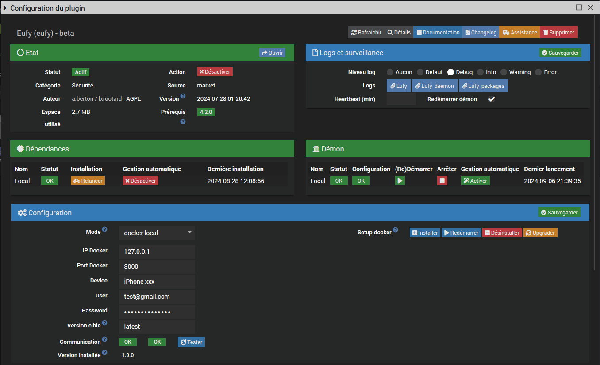

# Plugin Jeedom pour les Devices/Stations Eufy


## Documentation
- [Configuration](#configuration)
- [Auto-Découverte](#auto-decouverte)
- [Synchronisation](#synchronisation)
- [Santé](#health)
- [Equipements](#equipments)
- [Bugs et dépannage](#troubleshooting)

### Configuration

Installer le plugin et ses dépendances.
Vous avez le choix entre les modes local et distant pour docker ou lxc.

Note: 
* L'installation des dépendances n'installe PAS l'image `eufy-security-ws`.

#### 1. Paramètres communs
- Container Docker: adresse IP et port du container `eufy-security-ws`, `localhost:3000` par défaut
- Port socket deamon: port du deamon eufyd, `60600` par défaut. Ne changez pas cette valeur sauf si vous avez un conflit avec un autre plugin
- Tester: Vérifier la présence du container `eufy-security-ws` et sa connexion au service Cloud Eufy

Notes:
- Le daemon Eufy ne démarrera pas si le container `eufy-security-ws` ne peut pas se connecter au service Cloud Eufy.
- La version d'image installée (si elle existe) est indiquée dans le champ `Version installée`

#### 2. Mode local


L'installation du mode local a pour prérequis les modules `docker`. Ils sont maintenant installés et configurés automatiquement.

Le plugin ne nécessite pas l'utilisation du `#plugin-docker2` mais il est possible d'importer le fichier généré `data/docker-compose.yml` si vous préférez gérer l'image vous même avec ce plugin.

Paramètres supplémentaires:
- Device: nom de votre téléphone dans l'app Eufy, utilisé pour se connecter au serveur Cloud Eufy
- Utilisateur et mot de passe: il est conseillé de créer un utilisateur dédié
- Version cible: `latest` par défaut ou la version que vous souhaitez

Configuration de l'image docker post-installation:

- Installer: installe et démarre l'image `eufy-security-ws`
- Redémarrer: redémarre le service `eufy-security-ws` (à relancer si vous changez les paramètres du container)
- Désinstaller: arrête et déinstalle l'image `eufy-security-ws`
- Upgrader: met à jour l'image `eufy-security-ws` avec la version demandée

Réseau mode host: Mode réseau docker bridge (défaut) ou host. A modifier si vous rencontrez des problèmes de connectivité

#### 3. Mode local en ligne de commande (expert)

Une fois les dépendances installées vous pouvez aussi utiliser le script `eufy` disponible dans `resources`
pour installer, vérifier et gérer l'image `eufy-security-ws` et tester vos caméras en ligne de commande:

```
$ ./eufy
usage: eufy [-h] [-d device] [-u url] action
-h show this help message and exit
action: { install|uninstall|upgrade|start|stop|restart|status|info|logs|test }
test optional arguments:
      -d DEVICE device serial number
      -u URL eufy service URL, default 127.0.0.1:3000
```

```
eufy status # check the image and container status
eufy info # check the image and container status (extended info)
eufy test # check if the container is connected to the eufy cloud
eufy logs # get the container logs
```
#### 4. Mode distant (expert)


A utiliser si vous avez déployé l'image `eufy-security-ws` sur un docker ou un lxc distant.
Voici les fichiers à adapter et copier sur le serveur distant:
```
resources/docker-compose.yml
resources/eufy
```

### Auto-Découverte


Détection et création automatique des devices.
Note:<br> Seuls certains modèles ont été testés. La liste complète des modèles susceptibles de fonctionner est disponible [ici](https://bropat.github.io/eufy-security-client/#/supported_devices).
Si votre modèle est dans cette liste et ne fonctionne pas comme prévu vous pouvez m'envoyer le résutat de la commande `eufy test`. Voir [Devices ou commandes non supportées](#devices-ou-commandes-non-supportees) pour plus d'infos.

### Synchronisation

Mise à jour des valeurs de tous les devices actifs. Vous pouvez également mettre à jour chaque device avec la comande `Rafraichir`

### Santé


Liste et statut des devices actifs. 

### Equipements


Les commandes sont réparties entre les catégories Station et Caméra. 
<br>L'image du device peut être modifiée si nécessaire.
<br>L'onglet Autres commandes regroupe la présence, la commande `Rafraichir` et les commandes supplémentaires. 
Les commandes supplémentaires suivantes peuvent être créées:

#### Commandes station
- Carillon
- Déclencher l'alarme
- Arrêter l'alarme
- Reboot

#### Commandes Pan & Tilt (caméras motorisées)
- Haut, bas, gauche, droite
- Calibrage


Attention! Ces commandes peuvent fonctionner ou non selon le modèle.

#### Renommage des labels (menus déroulants)


Il est possible de renommer les labels des menus déroulants. Ex ici Custom1 en Alarm pour la commande `guardMode`. Le format est le suivant:

`0|Away;1|Home;2|Schedule;3|Alarm;4|Custom 2;5|Custom 3;47|Geofencing;63|Disarmed`

Attention! Ne pas modifier les valeurs.

#### Widgets

Si mes widgets custom sont installés ils seront automatiquement appliqués: snapshot,liste déroulante, mode alarme, switch. Pour plus d'informations voir [ici](https://github.com/lxrootard/widgets_v4).


#### Snapshots

La commande `Last Camera Picture` contient l'URL de l'image sur le serveur
<br> Vous pouvez utiliser mon widget [ImageViewer](https://github.com/lxrootard/widgets_v4).
<br> Pensez à activer les notifications d'image dans les paramètres de vos devices depuis l'application Eufy sans quoi les snapshots ne seront pas mis à jour

#### Video stream RTSP
Le flux RTSP fonctionne dans le plugin [Camera](https://doc.jeedom.com/fr_FR/plugins/security/camera) ou une application comme VLC.
<br>Il doit être activé/désactivé via les commandes de l'équipement `RTSP Stream On` et `RTSP Stream Off`.
<br>Selon les devices le login/passwd est celui du compte Eufy ou celui généré par l'application sur la page
`Paramètres > General > Stockage > NAS(RTSP)`
<br>L'IP est celle de la base ou celle de la caméra 
<br>`live0..liven` indiquent le numéro de la caméra, cf ce screenshot:


<br>Voir [ici](https://camlytics.com/camera/eufy) et [la](https://support.eufy.com/s/article/Using-NAS-Storage-Step-by-Step) selon votre modèle

### Bugs et dépannage

#### Prérequis non trouvés
<br> Pour le mode `local` les prérequis `docker` sont installés automatiquement avec le bouton `Setup Docker > Installer`. Un `python_venv` est également installé automatiquement pour `debian 12+`

#### Le voyant du conteneur Docker (à gauche) est rouge  
L’installation de l’image Docker a échoué ou le conteneur ne démarre pas. Assurez-vous que l’image est correctement installée.  
<br> Note: <br>@bropat ne fournit plus d’images armv7 (Pi3), la dernière version disponible est la 1.7.1.

#### Le voyant du cloud Eufy (à droite) est rouge  
Cela signifie que l’authentification au cloud Eufy a échoué ou qu’Eufy empêche la connexion pour des raisons de sécurité (ex trop d'erreurs de login). Vérifiez que votre identifiant Eufy, votre mot de passe et le nom de l’appareil sont corrects.
<br>Attention le 2FA n'est pas supporté. 

#### Le démon ne démarre pas

Vérifiez l'état de l’image Docker, du conteneur et de la connexion au cloud (voir ci-dessous).
<br>Si l’image Docker est correctement installée, sa version sera affichée sur la ligne `installed version`.
<br>Les indicateurs d’état du conteneur et de la connexion au cloud doivent tous deux être verts (voir ci-dessous).
<br>Utilisez le script `eufy` dans `resources` pour obtenir plus d’informations.  
Consultez la section [Mode local (expert)](docs/en_US/index.md#configuration) pour plus de détails.

#### Echec de synchronisation, devices non trouvés  
Les apostrophes et les guillemets ne sont pas pris en charge dans les noms des équipements.

#### Erreur schéma incompatible, les commandes ne fonctionnent pas  
Assurez-vous d’utiliser la bonne [version](https://github.com/bropat/eufy-security-ws/releases) de l'image `eufy-security-ws`.  
La version installée est affichée sur la page de configuration du plugin lorsque vous cliquez sur le bouton `Tester`.  
<br> Si vous avez mis à jour le plugin, essayez de désinstaller puis de réinstaller l’image et de redémarrer le conteneur.

#### Certaines actions ne fonctionnent pas (ex. flash on/off)  
Il ne s’agit pas d’actions mais de settings qui n’affectent le comportement du device qu’à la prochaine détection (ex. le flash s’allumera lors du prochain événement).

#### Les snapshots des caméras ne se mettent pas à jour  
Activez les instantanés dans l’application Eufy : `Appareil > Paramètres > Notification`

#### Problèmes de connexion
En cas de problème vérifier la connexion avec le container via la commande `eufy` disponible dans `resources`:

    $ cd /var/www/html/plugins/eufy
    $ ./resources/eufy test

Vous devriez obtenir l'output suivant:
```
{"type":"result","success":true,"result":{"state":{"driver":{"version":"2.4.0","connected":true,"pushConnected":true}
```
Note: `connected` et `pushConnected` doivent être à `true`

#### Devices ou commandes non supportées
Vérifiez si le device et/ou la commande existe

    $ cd /var/www/html/plugins/eufy
    $ ./resources/eufy -d device_serial test

Note: `device_serial` est l'identifiant de votre device commencant par `Txxx`

#### Autres problèmes
Consultez le forum [Jeedom community](https://community.jeedom.com/tag/plugin-eufy)
